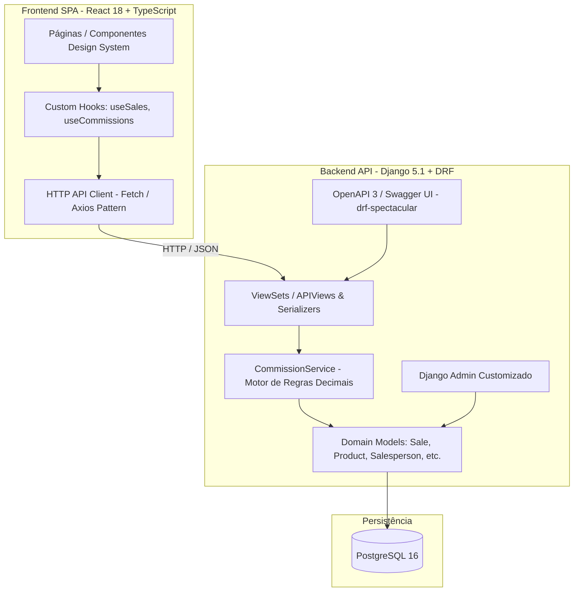

# 📚 Sistema de Gestão de Vendas e Comissões para Papelaria
### Desafio Técnico — Spassu Tecnologia

[](https://www.python.org/)
[](https://www.djangoproject.com/)
[](https://www.django-rest-framework.org/)
[](https://react.dev/)
[](https://vitejs.dev/)
[](https://www.typescriptlang.org/)
[](https://www.postgresql.org/)
[](https://www.docker.com/)


---


## 📌 1. Visão Geral Projeto

Este projeto consiste em uma solução corporativa completa de **Gestão de Vendas e Apuração Dinâmica de Comissões** desenvolvida para atender às operações diárias de uma rede de papelarias.

O sistema resolve um problema clássico de vendas no varejo: **cada produto possui um percentual nominal de comissão cadastrado**, porém, a comissão efetiva concedida ao vendedor depende do **dia da semana** em que a venda foi efetuada, sendo delimitada por uma faixa de **piso (mínimo)** e **teto (máximo)** configurada administrativamente para cada dia.

A solução garante **precisão decimal exata**, **imutabilidade dos dados históricos de venda**, **transações financeiras atômicas**, interface web moderna e responsiva e **documentação OpenAPI 3.0 interativa (Swagger UI)**.

---

## 🏗️ 2. Arquitetura da Solução

O sistema adota uma arquitetura em camadas desacoplada (Clean/Layered Architecture), separando as preocupações de apresentação, domínio, persistência e infraestrutura:



### Tecnologias Utilizadas

| Camada | Tecnologia | Propósito / Benefício |
| :--- | :--- | :--- |
| **Backend** | Python 3.11+ / Django 5.1 | Robustez, segurança, ORM maduro e agilidade no desenvolvimento. |
| **API REST** | Django REST Framework (DRF) | Serialização rigorosa de dados, validações e padrões RESTful. |
| **Documentação** | `drf-spectacular` | Geração automática e validação de esquemas OpenAPI 3.0 / Swagger UI. |
| **Banco de Dados** | PostgreSQL 16 (ou SQLite local) | Integridade referencial, constraints atômicas e precisão numérica. |
| **Frontend** | React 18 + TypeScript + Vite 6 | Tipagem estática fim a fim, alta performance e reatividade. |
| **Design System** | CSS Modules + Variáveis Globais | Estilização moderna, responsiva, com dark/light mode e sem frameworks pesados. |
| **Testes Backend** | `pytest` + `pytest-django` | Testes automatizados rápidos com fixtures e isolamento transacional. |
| **Testes Frontend**| `Vitest` + Testing Library | Testes unitários e de integração de componentes frontend em alta velocidade. |
| **Conteinerização** | Docker & Docker Compose | Ambientes consistentes e reprodutíveis para desenvolvimento e produção. |

---

## 🎯 3. Principais Funcionalidades

### 1. Registro de Nova Venda (User Story 1 - MVP)
- Seleção de Cliente e Vendedor ativos cadastrados na papelaria.
- Inserção manual de **Número da Nota Fiscal** com validação rigorosa de unicidade.
- Seleção da data/hora da venda com detecção automática do dia da semana (`0=Segunda` ... `6=Domingo`).
- Adição dinâmica de múltiplos itens com quantidade (mínimo 1 unidade).
- **Cálculo Dinâmico de Comissão**:
  - Aplicação dos limites do dia da semana: se a comissão nominal for menor que o piso, eleva-se ao piso; se for maior que o teto, reduz-se ao teto.
  - **Congelamento Histórico**: o preço unitário e o percentual de comissão são gravados no momento da venda, garantindo que alterações cadastrais futuras não distorçam relatórios históricos.
- Gravação transacional atômica (`transaction.atomic`).

### 2. Consulta e Listagem de Vendas (User Story 2)
- Tabela com histórico completo de vendas ordenadas cronologicamente.
- Exibição de Nota Fiscal, Cliente, Vendedor, Data Formatada, Total da Venda e Total de Comissão.
- Modal de Detalhamento com lista dos itens vendidos, quantidades, preços unitários congelados, percentuais aplicados e comissões individuais calculadas.

### 3. Apuração de Comissões por Período (User Story 3)
- Relatório analítico por intervalo de datas (`start_date` a `end_date`).
- Agrupamento de comissões acumuladas e contagem de vendas por vendedor.
- Exclusão automática de vendedores sem vendas no período informado.
- Card em destaque com o **Valor Total Geral de Comissões** do período.

### 4. Painel Administrativo Completo (User Story 4)
- Gestão via Django Admin (`/admin/`):
  - **Produtos**: Código, Descrição, Preço Unitário e Percentual Nominal de Comissão (validado entre 0% e 10%).
  - **Vendedores** e **Clientes**: Cadastros completos com e-mails e telefones.
  - **Regras dos Dias da Semana**: Configuração de piso e teto para cada um dos 7 dias, com validação de que o percentual mínimo nunca seja maior que o máximo.
  - **Vendas e Itens**: Visualização tabular com itens em formato *inline* e campos congelados como somente-leitura.

---

## ⚖️ 4. Regras de Negócio e Princípios Constitucionais

1. **Precisão Monetária Absoluta (Sem `float`)**:
   - Todo cálculo monetário utiliza a classe `Decimal` de alta precisão com arredondamento bancário (`ROUND_HALF_UP`).
2. **Delimitação Dinâmica por Dia da Semana**:
   - A comissão do item é calculada pela fórmula:
     $$\text{Percentual Efetivo} = \max(\text{Piso}_{\text{dia}}, \min(\text{Comissao}_{\text{produto}}, \text{Teto}_{\text{dia}}))$$
     $$\text{Comissão Item} = \text{round}\left(\text{Quantidade} \times \text{Preço Unitário} \times \frac{\text{Percentual Efetivo}}{100},\ 2\right)$$
3. **Nota Fiscal Única**:
   - Não é permitido reutilizar o mesmo número de nota fiscal em vendas distintas.
4. **Catálogo Somente-Leitura na Venda**:
   - O preço unitário do item é obtido diretamente do catálogo e não pode ser manipulado pelo cliente HTTP.

---

## 🚀 5. Execução Rápida via Docker (Recomendado)

O projeto está 100% conteinerizado e pronto para rodar em poucos minutos, contando com orquestrações dedicadas para **produção** (padrão) e **desenvolvimento local**.

### Pré-requisitos
- [Docker](https://docs.docker.com/get-docker/) (versão 24+)
- [Docker Compose](https://docs.docker.com/compose/) (versão 2+)

### Modo Produção (Padrão: Nginx + Gunicorn)

O arquivo padrão `docker-compose.yml` está configurado para o ambiente de produção otimizado (Frontend compilado servido via Nginx Alpine com compressão e Backend servido via Gunicorn com múltiplos workers):

```bash
# 1. Clone o repositório e acerte o diretório
git clone <url-do-repositorio>
cd projeto-spassu

# 2. Suba o ambiente de produção diretamente com o compose padrão:
docker compose up --build -d
```

> **Nota**: No modo de produção, as migrações e a carga inicial de dados (`seed_data`) são executadas automaticamente na inicialização do contêiner do backend.

### Modo Desenvolvimento (Hot-Reload com `docker-compose.local.yml`)

Para desenvolvimento local com recarregamento em tempo real (hot-reload), sincronização de código e logs dinâmicos, utilize o arquivo `docker-compose.local.yml`:

```bash
# 1. Suba os serviços em background com build (modo desenvolvimento)
docker compose -f docker-compose.local.yml up --build -d

# 2. Aplique as migrações no banco PostgreSQL (se necessário)
docker compose -f docker-compose.local.yml exec backend python manage.py migrate

# 3. Popule os dados iniciais de demonstração (seed)
docker compose -f docker-compose.local.yml exec backend python manage.py seed_data
```

### URLs de Acesso

| Serviço | URL | Credenciais / Observação |
| :--- | :--- | :--- |
| **Frontend Web** | `http://localhost:3000/` | Aplicação React interativa |
| **Backend API** | `http://localhost:8000/api/v1/` | Endpoints RESTful |
| **Swagger UI** | `http://localhost:8000/api/docs/` | Documentação OpenAPI interativa |
| **ReDoc** | `http://localhost:8000/api/redoc/` | Documentação técnica alternativa |
| **Django Admin** | `http://localhost:8000/admin/` | **Usuário**: `admin` \| **Senha**: `admin123` |

---

## 💻 6. Execução Bare-Metal Local (Sem Docker)

Caso prefira executar nativamente em sua máquina:

### 1. Pré-requisitos
- Python 3.11+
- Node.js 20+ e npm

### 2. Configurando o Backend

```bash
cd backend

# Criar e ativar ambiente virtual
python -m venv .venv
# No Windows:
.venv\Scripts\activate
# No Linux/macOS:
source .venv/bin/activate

# Instalar dependências
pip install -r requirements.txt

# Executar migrações do banco (utiliza SQLite por padrão sem PostgreSQL configurado)
python manage.py migrate

# Popular dados de teste
python manage.py seed_data

# Iniciar o servidor de desenvolvimento
python manage.py runserver 0.0.0.0:8000
```

### 3. Configurando o Frontend

Em outro terminal:

```bash
cd frontend

# Instalar dependências
npm install

# Iniciar servidor Vite
npm run dev
```

Acesse `http://localhost:3000`.

---

## 🧪 7. Execução dos Testes Automatizados

A suíte de testes cobre regras de negócio, cálculos decimais, endpoints de API, integridade do banco e renderização de componentes de interface.

### Testes do Backend (29 Testes Unitários e de Integração)

```bash
# Executando localmente no virtualenv:
cd backend
pytest

# Ou executando via Docker Compose:
docker compose exec backend pytest
# Ou no ambiente de desenvolvimento:
docker compose -f docker-compose.local.yml exec backend pytest
```

Exemplo de saída:
```text
============================= test session starts =============================
collected 29 items

backend/tests/test_commission_api.py::TestCommissionReportEndpoint::... PASSED
backend/tests/test_commission_service.py::TestCommissionServiceCalculations::... PASSED
backend/tests/test_commission_service.py::TestModelAndAdminValidationRules::... PASSED
backend/tests/test_quickstart_validation.py::TestQuickstartValidationScenarios::... PASSED
backend/tests/test_sales_api.py::TestSaleCreateEndpoint::... PASSED
backend/tests/test_sales_api.py::TestSaleListEndpoint::... PASSED
backend/tests/test_sales_api.py::TestSaleRetrieveEndpoint::... PASSED
backend/tests/test_sales_api.py::TestReadOnlyCatalogEndpoints::... PASSED
backend/tests/test_sales_api.py::TestDocumentationEndpoints::... PASSED

============================= 29 passed in 0.88s ==============================
```

### Testes do Frontend (34 Testes de Componentes e Rotas)

```bash
# Executando localmente:
cd frontend
npm test -- --run

# Ou executando via Docker Compose (modo desenvolvimento):
docker compose -f docker-compose.local.yml exec frontend npm test -- --run
```

Exemplo de saída:
```text
 ✓ tests/components/Button.test.tsx (3 tests)
 ✓ tests/components/Toast.test.tsx (3 tests)
 ✓ tests/pages/SaleEdit.test.tsx (5 tests)
 ✓ tests/pages/SalesList.test.tsx (7 tests)
 ✓ tests/App.test.tsx (6 tests)
 ✓ tests/pages/SaleCreate.test.tsx (5 tests)
 ✓ tests/pages/Commissions.test.tsx (5 tests)

 Test Files  7 passed (7)
      Tests  34 passed (34)
```

### Build de Produção do Frontend

```bash
cd frontend
npm run build
```

---

## 📋 8. Roteiro de Demonstração (Quickstart)

Para validar a solução na prática seguindo o roteiro do desafio:

1. **Acesse a Aplicação**: Abra `http://localhost:3000` no navegador.
2. **Nova Venda com Cálculo por Dia da Semana**:
   - Vá para **Vendas > Nova Venda**.
   - Digite a Nota Fiscal: `NF-2026-001`.
   - Escolha uma **segunda-feira** (Regra do seed: Mínimo 3% e Máximo 5%).
   - Selecione o Vendedor **Carlos Eduardo**.
   - Adicione o produto **Caderno Universitário** (comissão nominal de 10%, R$ 50,00), Quantidade = `2`.
     - *Resultado*: Total do item R$ 100,00. A taxa nominal de 10% é limitada ao teto de 5%, resultando em **R$ 5,00** de comissão.
   - Adicione o produto **Caneta Esferográfica** (comissão nominal de 2%, R$ 100,00), Quantidade = `1`.
     - *Resultado*: Total do item R$ 100,00. A taxa nominal de 2% é elevada ao piso de 3%, resultando em **R$ 3,00** de comissão.
   - Clique em **Salvar Venda**.
   - O sistema grava a venda com Total de R$ 200,00 e Comissão Total de R$ 8,00.
3. **Validação de Nota Fiscal Duplicada**:
   - Tente submeter novamente com a mesma nota `NF-2026-001`.
   - O sistema rejeita e exibe a mensagem de validação de duplicidade.
4. **Consulta e Detalhamento**:
   - Na listagem de Vendas, clique na venda recém-criada para abrir o modal e inspecionar os itens com valores congelados.
5. **Apuração de Comissões por Período**:
   - No menu superior, clique em **Comissões**.
   - Filtre o mês correspondente à data da venda informada.
   - O vendedor Carlos Eduardo é exibido com o total de R$ 8,00 de comissões acumuladas, e o card de total geral exibe R$ 8,00. Vendedores sem vendas no período não são listados.
6. **Configuração de Regras no Admin**:
   - Acesse `http://localhost:8000/admin/` e autentique-se com `admin` / `admin123`.
   - Modifique a regra de comissão de qualquer dia da semana ou cadastre novos produtos e observe o comportamento no frontend.

---

## 📁 9. Estrutura de Diretórios do Projeto

```text
projeto-spassu/
├── backend/                        # Backend Django + DRF
│   ├── apps/
│   │   └── sales/                  # Aplicação principal de vendas e comissões
│   │       ├── admin.py            # Customização do Django Admin
│   │       ├── models.py           # Modelos de domínio (Sale, Product, Customer, etc.)
│   │       ├── serializers.py      # Serializadores DRF e validações
│   │       ├── views.py            # ViewSets e endpoints da API REST
│   │       ├── urls.py             # Mapeamento de rotas da API v1
│   │       ├── services/           # Lógica pura de domínio
│   │       │   └── commission_service.py # Motor de cálculo de comissões
│   │       └── management/commands/ # Comandos customizados (seed_data.py)
│   ├── core/                       # Configurações do projeto Django
│   │   ├── settings.py
│   │   └── urls.py                 # Rotas raiz, Admin e OpenAPI/Swagger
│   ├── tests/                      # Bateria de testes automatizados (pytest)
│   ├── Dockerfile                  # Dockerfile de produção do backend
│   └── requirements.txt            # Dependências Python
├── frontend/                       # Frontend React 18 + Vite + TypeScript
│   ├── src/
│   │   ├── components/             # Componentes reutilizáveis do Design System
│   │   ├── hooks/                  # Custom hooks de consumo de dados
│   │   ├── pages/                  # Páginas (SaleCreate, SalesList, Commissions)
│   │   ├── services/               # Clientes HTTP e chamadas de API
│   │   └── types/                  # Definições de tipos TypeScript
│   ├── tests/                      # Testes automatizados (Vitest + Testing Library)
│   ├── Dockerfile                  # Dockerfile multi-stage (builder + Nginx)
│   ├── nginx.conf                  # Configuração do Nginx com proxy reverso
│   └── package.json                # Dependências Node.js
├── specs/                          # Especificações técnicas e planos (Spec-Kit)
│   └── 001-sales-commission-system/
│       ├── spec.md                 # Especificação de requisitos e user stories
│       ├── plan.md                 # Plano arquitetural e de implementação
│       ├── tasks.md                # Lista de tarefas rastreáveis (T001 - T046)
│       └── quickstart.md           # Guia de validação ponta a ponta
├── docker-compose.local.yml        # Orquestração para desenvolvimento local (hot-reload)
├── docker-compose.yml              # Orquestração padrão para produção (Nginx + Gunicorn)
└── README.md                       # Documentação principal do projeto
```

---

## 👥 Autor
Projeto desenvolvido como demonstração técnica para o processo seletivo da **Spassu Tecnologia**.
Desenvolvido com foco em **qualidade de software**, **testabilidade**, **boas práticas de engenharia** e **fidelidade aos requisitos de negócio**.
