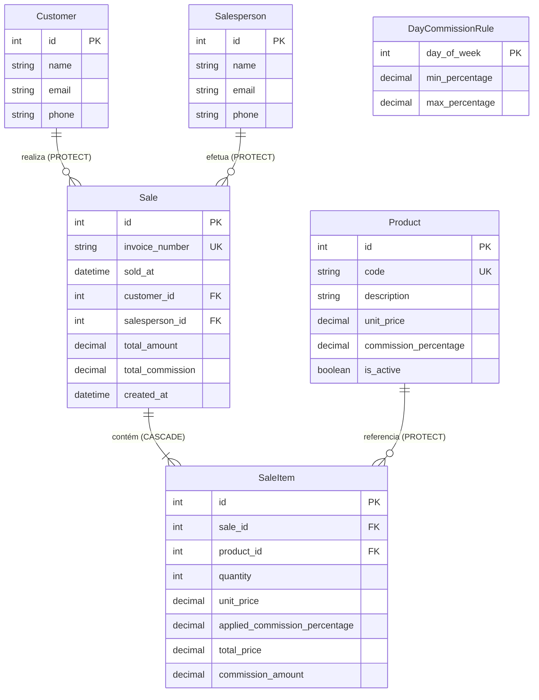

# Data Model Specification: Sistema de Vendas e Comissões de Papelaria

**Feature**: `001-sales-commission-system`
**Date**: 2026-09-17
**Status**: Completed

---

## 1. Diagrama Entidade-Relacionamento (ERD)

---

## 2. Especificação das Entidades e Campos

### 2.1. `Product` (Produto)
Representa as mercadorias comercializadas pela papelaria com sua respectiva taxa de comissão padrão.

| Campo | Tipo | Nulável | Chave / Restrição | Descrição |
| :--- | :--- | :---: | :--- | :--- |
| `id` | `BigAutoField` | Não | **PK** | Identificador único numérico |
| `code` | `CharField(50)` | Não | **Unique** | Código de referência do produto (SKU/código) |
| `description` | `CharField(255)`| Não | - | Nome / descrição do produto |
| `unit_price` | `DecimalField(12, 2)`| Não | `Check(unit_price > 0)` | Valor unitário em reais (R$) |
| `commission_percentage` | `DecimalField(5, 2)` | Não | `Check(0.00 <= commission_percentage <= 10.00)` | Comissão nominal cadastrada (0% a 10%) |
| `is_active` | `BooleanField` | Não | Default: `True` | Indica se o produto está disponível para novas vendas |
| `created_at` | `DateTimeField` | Não | `auto_now_add=True` | Data/hora do cadastro |
| `updated_at` | `DateTimeField` | Não | `auto_now=True` | Data/hora da última alteração |

---

### 2.2. `Customer` (Cliente)
Representa os clientes cadastrados na papelaria.

| Campo | Tipo | Nulável | Chave / Restrição | Descrição |
| :--- | :--- | :---: | :--- | :--- |
| `id` | `BigAutoField` | Não | **PK** | Identificador único |
| `name` | `CharField(200)`| Não | - | Nome completo do cliente |
| `email` | `EmailField(254)`| Não | - | E-mail de contato |
| `phone` | `CharField(20)` | Não | - | Telefone de contato formatado |
| `created_at` | `DateTimeField` | Não | `auto_now_add=True` | Data/hora de registro |
| `updated_at` | `DateTimeField` | Não | `auto_now=True` | Data/hora da última alteração |

---

### 2.3. `Salesperson` (Vendedor)
Representa os profissionais de vendas da papelaria responsáveis pelas vendas e recebedores de comissão.

| Campo | Tipo | Nulável | Chave / Restrição | Descrição |
| :--- | :--- | :---: | :--- | :--- |
| `id` | `BigAutoField` | Não | **PK** | Identificador único |
| `name` | `CharField(200)`| Não | - | Nome completo do vendedor |
| `email` | `EmailField(254)`| Não | - | E-mail corporativo / contato |
| `phone` | `CharField(20)` | Não | - | Telefone de contato |
| `created_at` | `DateTimeField` | Não | `auto_now_add=True` | Data/hora de registro |
| `updated_at` | `DateTimeField` | Não | `auto_now=True` | Data/hora da última alteração |

---

### 2.4. `DayCommissionRule` (Regra de Comissão por Dia da Semana)
Configuração parametrizável de limites de comissão para cada dia da semana.

| Campo | Tipo | Nulável | Chave / Restrição | Descrição |
| :--- | :--- | :---: | :--- | :--- |
| `id` | `BigAutoField` | Não | **PK** | Identificador único |
| `day_of_week` | `PositiveSmallIntegerField` | Não | **Unique**, `Choices(0..6)` | 0 = Segunda-feira ... 6 = Domingo |
| `min_percentage` | `DecimalField(5, 2)` | Não | `Check(0.00 <= min <= 10.00)` | Piso de comissão aplicável no dia |
| `max_percentage` | `DecimalField(5, 2)` | Não | `Check(min <= max <= 10.00)` | Teto de comissão aplicável no dia |
| `updated_at` | `DateTimeField` | Não | `auto_now=True` | Data/hora da última alteração do parâmetro |

---

### 2.5. `Sale` (Venda)
Representa o registro da transação comercial.

| Campo | Tipo | Nulável | Chave / Restrição | Descrição |
| :--- | :--- | :---: | :--- | :--- |
| `id` | `BigAutoField` | Não | **PK** | Identificador único |
| `invoice_number`| `CharField(50)` | Não | **Unique** | Número da nota fiscal informado manualmente pelo operador |
| `sold_at` | `DateTimeField` | Não | `db_index=True` | Data e hora em que a venda foi realizada |
| `customer` | `ForeignKey(Customer)` | Não | `on_delete=models.PROTECT` | Cliente associado à venda |
| `salesperson` | `ForeignKey(Salesperson)`| Não | `on_delete=models.PROTECT`, `db_index=True` | Vendedor responsável pela transação |
| `total_amount` | `DecimalField(12, 2)` | Não | Default: `0.00` | Valor total consolidado da venda |
| `total_commission`| `DecimalField(12, 2)`| Não | Default: `0.00` | Valor total de comissão consolidado da venda |
| `created_at` | `DateTimeField` | Não | `auto_now_add=True` | Registro no sistema |
| `updated_at` | `DateTimeField` | Não | `auto_now=True` | Última atualização |

---

### 2.6. `SaleItem` (Item da Venda)
Representa cada linha de produto adicionada a uma venda.

| Campo | Tipo | Nulável | Chave / Restrição | Descrição |
| :--- | :--- | :---: | :--- | :--- |
| `id` | `BigAutoField` | Não | **PK** | Identificador único |
| `sale` | `ForeignKey(Sale)` | Não | `on_delete=models.CASCADE`, `related_name='items'` | Venda à qual o item pertence |
| `product` | `ForeignKey(Product)`| Não | `on_delete=models.PROTECT` | Produto comercializado |
| `quantity` | `PositiveIntegerField`| Não | `Check(quantity >= 1)` | Quantidade vendida de unidades |
| `unit_price` | `DecimalField(12, 2)`| Não | Congelado no momento da venda | Valor unitário de catálogo na data da venda |
| `applied_commission_percentage` | `DecimalField(5, 2)` | Não | Congelado no momento da venda | Percentual de comissão efetivamente aplicado |
| `total_price` | `DecimalField(12, 2)`| Não | `quantity * unit_price` | Valor total do item |
| `commission_amount` | `DecimalField(12, 2)`| Não | `total_price * applied_percentage / 100` | Valor de comissão gerado pelo item |

---

## 3. Regras de Integridade e Comportamento Transacional

1. **Integridade Referencial com `on_delete=models.PROTECT`**:
   - Clientes, Vendedores e Produtos que possuam vendas atreladas não podem ser excluídos fisicamente, prevenindo perda de histórico financeiro e relatórios inconsistentes.
2. **Criação Atômica de Venda (`transaction.atomic`)**:
   - A gravação de uma venda e de todos os seus itens deve ocorrer dentro de um bloco transacional atômico. Se o cálculo ou validação de qualquer item falhar, nenhum registro é salvo.
3. **Imutabilidade Histórica**:
   - O `unit_price` e o `applied_commission_percentage` são gravados em cada `SaleItem` com base no estado vigente no instante da venda.
   - Mudanças posteriores no preço ou na comissão de um produto não alteram vendas já registradas.
4. **Índices de Performance**:
   - Índice em `Sale.sold_at` para acelerar filtros de intervalo de datas na tela de Comissões.
   - Índice composto ou em `Sale.salesperson` para agilizar agrupamento de apurações por vendedor.
