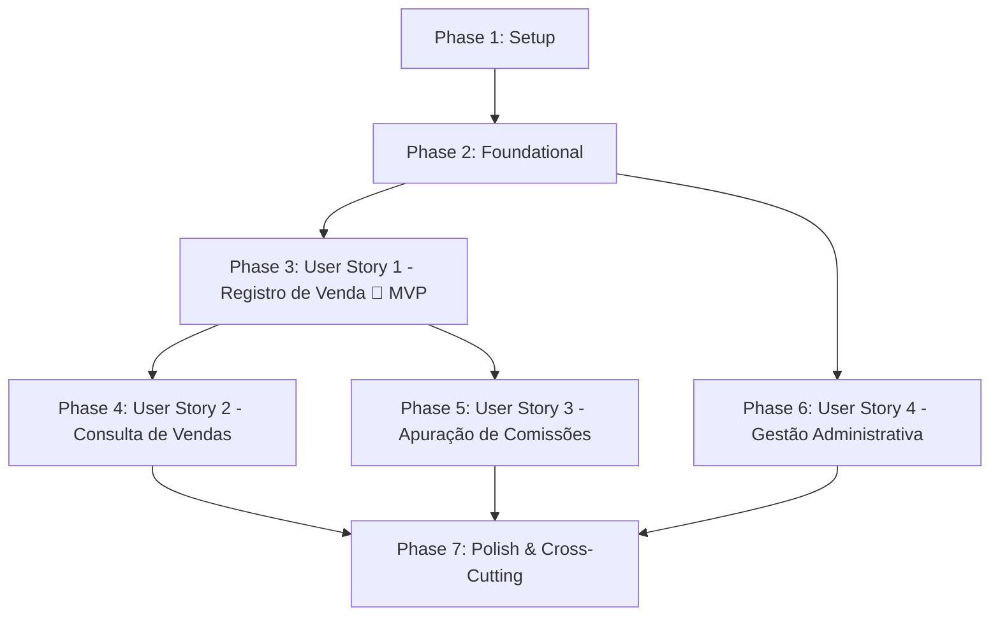

# Tasks: Sistema de Vendas e Comissões de Papelaria

**Input**: Design documents from `specs/001-sales-commission-system/` (`spec.md`, `plan.md`, `data-model.md`, `contracts/api-endpoints.md`, `quickstart.md`, `research.md`).

**Prerequisites**: `plan.md` (required), `spec.md` (required for user stories), `data-model.md`, `contracts/`.

**Organization**: Tarefas agrupadas por fases e por história de usuário (User Story), viabilizando desenvolvimento modular, entrega de MVP e testes independentes de cada funcionalidade.

---

## Format: `- [ ] [TaskID] [P?] [Story?] Description with file path`

- **[P]**: Tarefa paralelizada (arquivos distintos, sem dependência de tarefas incompletas).
- **[Story]**: Rótulo da história de usuário correspondente (`[US1]`, `[US2]`, `[US3]`, `[US4]`).
- Todos os caminhos de arquivos são explícitos e referenciam as pastas `backend/`, `frontend/` e a raiz do repositório.

---

## Phase 1: Setup (Shared Infrastructure)

**Purpose**: Inicialização da estrutura de diretórios, containers e parametrizações de ambiente.

- [X] T001 Create root environment templates and Docker Compose files in docker-compose.yml, docker-compose.prod.yml, .env.example, and .env.local
- [ ] T002 [P] Initialize Django backend project structure with dependencies in backend/requirements.txt, backend/manage.py, backend/core/settings.py, backend/core/urls.py, and backend/Dockerfile
- [ ] T003 [P] Initialize React with TypeScript frontend project using Vite in frontend/package.json, frontend/vite.config.ts, frontend/tsconfig.json, frontend/index.html, and frontend/Dockerfile
- [ ] T004 [P] Configure gitignore rules and code formatting conventions in .gitignore

---

## Phase 2: Foundational (Blocking Prerequisites)

**Purpose**: Infraestrutura básica necessária antes da implementação das histórias de usuário.

**⚠️ CRITICAL**: Nenhuma história de usuário deve ser iniciada antes da conclusão desta fase.

- [ ] T005 Configure PostgreSQL database connection with environment variable loading in backend/core/settings.py
- [ ] T006 [P] Configure Django REST Framework and drf-spectacular OpenAPI/Swagger documentation routes in backend/core/settings.py and backend/core/urls.py
- [ ] T007 [P] Configure CORS headers and security middleware in backend/core/settings.py
- [ ] T008 [P] Create core domain models (Product, Customer, Salesperson, DayCommissionRule) with Decimal fields and validations in backend/apps/sales/models.py
- [ ] T009 Generate and apply initial database migrations for domain models in backend/apps/sales/migrations/0001_initial.py
- [ ] T010 Create management command for database seeding (7 weekday commission rules and initial demo data) in backend/apps/sales/management/commands/seed_data.py
- [ ] T011 [P] Configure frontend HTTP client Axios instance and base TypeScript interfaces in frontend/src/services/api.ts and frontend/src/types/index.ts
- [ ] T012 [P] Setup global CSS design system tokens and typography matching Spassu Figma prototype in frontend/src/index.css
- [ ] T013 [P] Create reusable UI components (Button, Card, Table, Input, Navbar) in frontend/src/components/
- [ ] T014 [P] Configure Vitest and React Testing Library setup in frontend/vite.config.ts and frontend/tests/setup.ts

**Checkpoint**: Fundação pronta - a implementação das histórias de usuário pode começar.

---

## Phase 3: User Story 1 - Registro de Venda com Cálculo Dinâmico de Comissão (Priority: P1) 🎯 MVP

**Goal**: Permitir registrar uma nova venda vinculando cliente, vendedor, número da nota fiscal único, data/hora e itens de produtos, calculando automaticamente a comissão de cada item e o total da venda de acordo com os limites do dia da semana.

**Independent Test**: Registrar uma venda completa contendo produtos com comissões nominais abaixo do piso, acima do teto e dentro dos limites do dia da semana, validando a gravação exata dos valores e comissões calculadas.

### Tests for User Story 1 ⚠️
- [ ] T015 [P] [US1] Implement automated unit tests for commission calculation engine (CommissionService) in backend/tests/test_commission_service.py
- [ ] T016 [P] [US1] Implement automated integration tests for Sale creation REST API endpoint in backend/tests/test_sales_api.py
- [ ] T017 [P] [US1] Implement unit tests for SaleCreate form and dynamic subtotal calculations in frontend/tests/pages/SaleCreate.test.tsx

### Implementation for User Story 1
- [ ] T018 [P] [US1] Create Sale and SaleItem models with Decimal fields, unique invoice_number, and relationships in backend/apps/sales/models.py
- [ ] T019 [US1] Generate and apply database migrations for Sale and SaleItem in backend/apps/sales/migrations/0002_sale_saleitem.py
- [ ] T020 [US1] Implement CommissionService with dynamic day-of-week limits and Decimal precision in backend/apps/sales/services/commission_service.py
- [ ] T021 [P] [US1] Create DRF serializers for Sale creation and SaleItem validation (read-only unit_price, unique invoice_number) in backend/apps/sales/serializers.py
- [ ] T022 [US1] Implement SaleViewSet create endpoint with atomic transaction in backend/apps/sales/views.py and map routes in backend/apps/sales/urls.py
- [ ] T023 [P] [US1] Implement frontend sale API service and custom hook useSales in frontend/src/services/saleService.ts and frontend/src/hooks/useSales.ts
- [ ] T024 [US1] Implement SaleCreate form page component with customer/salesperson select, date, invoice number, and dynamic product item rows in frontend/src/pages/SaleCreate/index.tsx and frontend/src/pages/SaleCreate/SaleCreate.module.css

**Checkpoint**: Neste ponto, o MVP está funcional: vendas podem ser registradas com cálculo dinâmico de comissão e validação de nota fiscal única.

---

## Phase 4: User Story 2 - Consulta e Listagem de Vendas Realizadas (Priority: P1)

**Goal**: Visualizar a tabela de vendas cadastradas exibindo data/hora, cliente, vendedor, valor total em formato monetário Real (R$ pt-BR) e navegar para visualizar os detalhes e comissões da venda.

**Independent Test**: Acessar o menu "Vendas" no frontend e verificar se a listagem exibe todas as vendas com os dados exigidos, formatação correta de moeda e abertura do detalhamento de itens.

### Tests for User Story 2 ⚠️
- [ ] T025 [P] [US2] Implement automated integration tests for sales listing and sale detail API endpoints in backend/tests/test_sales_api.py
- [ ] T026 [P] [US2] Implement unit tests for SalesList page component and pt-BR currency formatting in frontend/tests/pages/SalesList.test.tsx

### Implementation for User Story 2
- [ ] T027 [P] [US2] Create SaleListSerializer and SaleDetailSerializer with formatted customer/salesperson data and item breakdowns in backend/apps/sales/serializers.py
- [ ] T028 [US2] Implement list and retrieve actions in SaleViewSet in backend/apps/sales/views.py
- [ ] T029 [P] [US2] Implement sales listing fetch logic in custom hook frontend/src/hooks/useSales.ts
- [ ] T030 [US2] Implement SalesList page component with table, pt-BR currency formatting, and detail modal/drawer in frontend/src/pages/SalesList/index.tsx and frontend/src/pages/SalesList/SalesList.module.css
- [ ] T031 [US2] Configure client-side routing in frontend/src/App.tsx connecting Navbar to /vendas and /vendas/nova

**Checkpoint**: Histórias de Usuário 1 e 2 completas e integradas (fluxo completo de criação e listagem de vendas).

---

## Phase 5: User Story 3 - Consulta de Total de Comissões por Período (Priority: P2)

**Goal**: Informar um período (data inicial e data final) e visualizar uma lista contendo exclusivamente os vendedores que realizaram vendas no período com suas respectivas comissões acumuladas, além do card com o total geral consolidado.

**Independent Test**: Consultar intervalos de datas conhecidos e confirmar que apenas vendedores com vendas no intervalo aparecem listados, com valores individuais e somatório geral correspondendo à soma das comissões registradas.

### Tests for User Story 3 ⚠️
- [ ] T032 [P] [US3] Implement automated integration tests for commission report endpoint by date range in backend/tests/test_commission_api.py
- [ ] T033 [P] [US3] Implement unit tests for Commissions report page component and empty/filled states in frontend/tests/pages/Commissions.test.tsx

### Implementation for User Story 3
- [ ] T034 [P] [US3] Create CommissionQuerySerializer with date validation (start_date <= end_date) and response serializers in backend/apps/sales/serializers.py
- [ ] T035 [US3] Implement CommissionReportView aggregating total commissions per salesperson and grand total in backend/apps/sales/views.py and map route in backend/apps/sales/urls.py
- [ ] T036 [P] [US3] Implement commission API service and custom hook useCommissions in frontend/src/services/commissionService.ts and frontend/src/hooks/useCommissions.ts
- [ ] T037 [US3] Implement Commissions report page component with date range filters, salesperson commission table, and grand total card in frontend/src/pages/Commissions/index.tsx and frontend/src/pages/Commissions/Commissions.module.css
- [ ] T038 [US3] Update client-side routing in frontend/src/App.tsx connecting Navbar to /comissoes

**Checkpoint**: Histórias de Usuário 1, 2 e 3 totalmente funcionais e testáveis de ponta a ponta.

---

## Phase 6: User Story 4 - Gestão Administrativa de Cadastros e Regras de Comissão (Priority: P2)

**Goal**: Permitir ao administrador cadastrar produtos, clientes, vendedores e configurar os percentuais mínimo e máximo de comissão para cada dia da semana através do Django Admin, com endpoints auxiliares de leitura para alimentar o frontend.

**Independent Test**: Acessar o Django Admin (`/admin/`), criar/editar limites de comissão por dia da semana e produtos, e validar que as regras ajustadas são respeitadas pelo formulário de vendas do frontend e pela API.

### Tests for User Story 4 ⚠️
- [ ] T039 [P] [US4] Implement automated tests for DayCommissionRule validation and Product commission bounds in backend/tests/test_commission_service.py

### Implementation for User Story 4
- [ ] T040 [P] [US4] Register and configure custom Django Admin interfaces for Product, Customer, and Salesperson in backend/apps/sales/admin.py
- [ ] T041 [US4] Register and configure custom Django Admin interface for DayCommissionRule with form validation (0% <= min <= max <= 10%) in backend/apps/sales/admin.py
- [ ] T042 [P] [US4] Expose read-only API endpoints for products, customers, salespeople, and day commission rules in backend/apps/sales/views.py and backend/apps/sales/urls.py

**Checkpoint**: Todas as histórias de usuário (US1 a US4) estão completas.

---

## Phase 7: Polish & Cross-Cutting Concerns

**Purpose**: Verificação e refinamentos que afetam a qualidade global, conteinerização e documentação.

- [ ] T043 [P] Validate OpenAPI / Swagger UI schemas at /api/docs/ ensuring 100% interactive endpoint documentation in backend/core/urls.py
- [ ] T044 [P] Create production Dockerfile and Nginx configuration for frontend in frontend/Dockerfile and frontend/nginx.conf
- [ ] T045 Execute quickstart validation scenarios end-to-end following specs/001-sales-commission-system/quickstart.md
- [ ] T046 [P] Write comprehensive project README.md with prerequisites, architecture, Docker setup instructions, test commands, and seed data guide in README.md

---

## Dependencies & Execution Order

### Phase Dependencies

- **Phase 1 (Setup)**: Pode iniciar imediatamente.
- **Phase 2 (Foundational)**: Depende da Fase 1; BLOQUEIA todas as histórias de usuário.
- **Phase 3 (User Story 1 - MVP)**: Depende da Fase 2.
- **Phase 4 (User Story 2)**: Depende da existência do modelo e registros da Venda (US1).
- **Phase 5 (User Story 3)**: Depende das vendas e comissões calculadas (US1).
- **Phase 6 (User Story 4)**: Pode rodar em paralelo após a Fase 2 (administração de dados).
- **Phase 7 (Polish)**: Depende de todas as histórias concluídas.

---

## Parallel Opportunities

- **Na Fase 1**: `T002`, `T003` e `T004` podem ser executadas em paralelo.
- **Na Fase 2**: `T006`, `T007`, `T008`, `T011`, `T012`, `T013` e `T014` podem ser executadas em paralelo.
- **Na Fase 3 (US1)**: Testes automatizados (`T015`, `T016`, `T017`) podem ser escritos em paralelo; serializers (`T021`) e serviço frontend (`T023`) podem ser implementados em paralelo aos models (`T018`).
- **Na Fase 4 (US2)**: Testes (`T025`, `T026`) e serializers/hooks (`T027`, `T029`) rodam em paralelo.
- **Na Fase 5 (US3)**: Testes (`T032`, `T033`) e serializers/hooks (`T034`, `T036`) rodam em paralelo.
- **Na Fase 7**: `T043`, `T044` e `T046` podem ser executadas em paralelo.

---

## Implementation Strategy

### 1. MVP Primeiro (Fases 1, 2 e 3)
1. Concluir Setup (Fase 1) e Foundational (Fase 2).
2. Implementar e testar o **User Story 1 (Registro de Venda com Cálculo de Comissão)**.
3. **Validar MVP**: Executar testes unitários e de integração do cálculo de comissão e registro de venda.

### 2. Entrega Incremental (Fases 4, 5 e 6)
1. Integrar **User Story 2 (Listagem de Vendas)**.
2. Integrar **User Story 3 (Consulta de Comissões por Período)**.
3. Consolidar **User Story 4 (Administração e Configuração de Limites no Django Admin)**.

### 3. Validação Final e Entrega (Fase 7)
1. Validar a documentação Swagger (`/api/docs/`).
2. Executar os roteiros do `quickstart.md`.
3. Validar build de produção e documentação do `README.md`.
